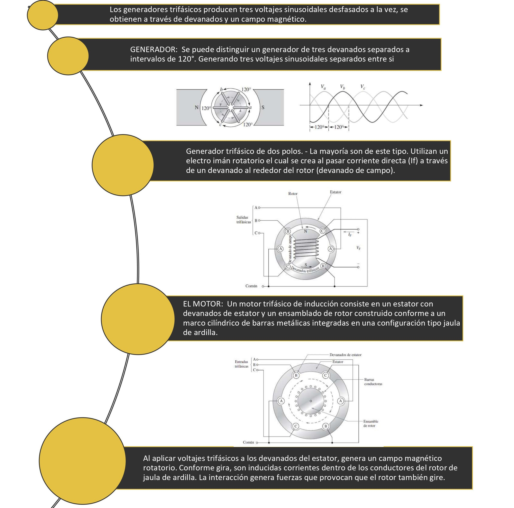

# Producto Unidad 3
1.OBJETIVOS

_OBJETIVOS GENERALES__

• 

• 

_OBJETIVOS ESPECÍFICOS:_

•	Analizar las ventajas de los generadores trifásicos en aplicaciones de potencia.

•	Analizar mediciones de potencia en sistemas de potencia.

•Realizar un análisis de sistemas trifásicos identificando los diferentes tipos para su resolución

•Identificar términos relevantes utilizados en el capítulo para, para una mejor compresión y análisis

 

2.MARCO TEÓRICO:

 _INTRODUCCIÓN A LAS MAQUINAS TRIFASICAS:_
 
 

3.DIAGRAMAS:

4.XPLICACIÓN:

5.CONCLUSIONES

•	En un sistema trifásico equilibrado los conductores necesitan ser el 75% del tamaño   que necesitarían para un sistema monofásico con la misma potencia en VA por lo que   esto ayuda a disminuir los costos y por lo tanto a justificar el tercer cable requerido. 

•	La potencia proporcionada por un sistema monofásico cae tres veces por ciclo. La potencia proporcionada por un sistema trifásico nunca cae a cero por lo    que la potencia enviada a la carga es siempre la misma.

6. BIBLIOGRAFÍA

•	Floyd Thomas L, “Principios de Circuitos Eléctricos”, 8 ed. 2007 .Pearson Educación de México, S.A. de C.V. México, pp. 281-333.

• 

• 

• 
